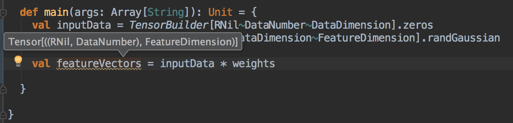

# TensorSafe

Encode tensor/matrix shapes into types

## Motivation

Writing tensor/matrix code is error-prone. Because the compiler doesn't
 stop you from writing code that multiplies two matrices with incompatible 
 shapes, for example.
 Instead, it lets your program run and run... oops! ... suddenly crashes. I 
 can recall myself wasting quite a lot time debugging problems like this.
 Wouldn't it be nice if we can detect such errors at compiling time?
 
That's why you need **TensorSafe**, a tensor computing wrapper library for
[nd4j](https://github.com/deeplearning4j/nd4j). TensorSafe encodes tensor
shape information into their types and uses type-level programming to detect
inappropriate computations and compute the resulting shapes for you.
 

## Basic Example

### Define the Dimensions

First, let's define the Dimensions we are going to need in this example.

A dimension is a type that extends the `Dimension` trait, and a user defined
dimension should extends `VarDim`, a subtrait of `Dimension` which means
"Variable Dimension".

```scala
package tensorsafe.example

import tensorsafe._

trait DataNumber extends VarDim

trait DataDimension extends VarDim

trait FeatureDimension extends VarDim

object BasicExample {

  def main(args: Array[String]): Unit = {
    // We'll write our tensors here
  }

}

```

### Define the tensors

With these dimensions in our hands, now we can define some tensors.

```scala
def main(args: Array[String]): Unit = {
    val inputData = TensorBuilder[RNil~DataNumber~DataDimension].ones
    val weights = TensorBuilder[RNil~DataDimension~FeatureDimension].rand
    
    val featureVectors = inputData * weights  // '*' means matrix multiplication
    
  }
```

Here we use `TensorBuilder` to create our tensors. The strange-looking
type parameter `RNil~DA~DB` simply means a tensor of shape DA * DB. RNil 
 marks the start of a type list, just similar to the Nil construct in a 
 normal scala List. But this type list grows rightward, so it's called a RList,
 and so called this RNil.

By the way, ~ is just a type alias for tuple2, so A~B is equivalent to (A,B).

### What's the tensor shape? Ask your IDE

Now let's check the type of these tensors! I can easily find them out by asking
my IDE:



You see? `featureVectors` has the type `Tensor[((RNil,DataNum),FeatureDimension)]`, which
means it's a tensor of shape DataNum * FeatureDimension, Cheer! So in TensorSafe, you don't have
 to manually remember and track the shapes of every tensor any more.
 
### Provide DimValues 
 
But wait! How dose the compiler know what values those dimensions should have?

If you run the code now... You'll see the following compile-time error:

```
Error:(14, 34) Not enough value information for Shape 'tensorsafe.~[tensorsafe.~[tensorsafe.RNil,tensorsafe.example.DataNumber],tensorsafe.example.DataDimension]'
 Please make sure that each dimension has a corresponding DimValue in scope. Zero-rank Tensor is not allowed.
    val inputData = TensorBuilder[RNil~DataNumber~DataDimension].zeros
```    

Which basically says you must provide an implicit `DimValue` for each dimension you use in the TensorBuilder.

Let's fix this.

```scala
def main(args: Array[String]): Unit = {
    import DimValue.const

    implicit val dataNumber = const[DataNumber](10)
    implicit val dataDimension = const[DataDimension](3)
    implicit val featureDimension = const[FeatureDimension](6)

    val inputData = TensorBuilder[RNil~DataNumber~DataDimension].ones
    val weights = TensorBuilder[RNil~DataDimension~FeatureDimension].rand

    val featureVectors = inputData * weights

    println(featureVectors)

  }
```

Now the program compiles, and print out the result.
  
### Broadcasting
  
TensorSafe also supports numpy-like [broadcasting](http://docs.scipy.org/doc/numpy-1.10.0/user/basics.broadcasting.html).

In the above example, we can add a 1D bias vector to the 2D featureVectors:
  
```scala
val bias = TensorBuilder[RNil~FeatureDimension].randGaussian
val featureVectors = inputData * weights + bias
```

It also works for cases with higher ranks:
  
```scala
val t1 = TensorBuilder[RNil~DataNumber~UnitDim~FeatureDimension].zeros // UnitDim is a dimension with value 1
val t2 = TensorBuilder[RNil~DataDimension~UnitDim].ones
val t3 = t1 + t2 // t3 has type Tensor[RNil~DataNumber~DataDimension~FeatureDimension]
```
  
### A more complex example
  
You can take a look at a neural network example from the file 
[NNExample.scala](src/main/scala-2.11/tensorsafe/example/NNExample.scala)
   

  